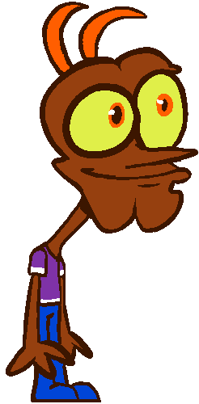

# Peepos AWESOME Strongman quiz :exclamation:

This is Peepo, he's hosting a strongman quiz!
(Project for Nology Game project)

## Objective :monocle_face:

I want to create a simple quiz with up to 5 different questions. It will be multiple choice with 4 different answers
to choose from. Only one answer is correct.

The users score will go up/update if they successfully answer a question. If unsuccessful, the score stays the same.

The total score is out of 5.

### Question Examples :thought_balloon:

> Q: Who won 2026's Worlds Strongest Man?

Choices:

- Rayno Nel
- Tom Stoltman
- Eddie Hall
- Mitchell Hooper

> A: Mitchell Hooper

## HTML

- [ ] Bullet Point NOT DONE
- [x] Bullet Point DONE

- [x] Main Title
- [x] Start Button
- [x] Image of Peepo
- [x] Question Text
- [x] We need a grid where the quiz will be
  - [x] Multiple choice answer buttons in the grid
  - [ ] Correct answer turns green
  - [ ] Incorrect answer turns red
- [ ] Play Again Button
- [x] We should add classes and ID's to things we need to reference/use
  - [ ] Answer buttons should have the same class for eg
  - [ ] Play again and start button should have IDs and Classes?
- [ ] Add some basic animations (I think this can be done through HTML??)

## SCSS

- [ ] Grid should be organised neatly with equal spacing where the answers are
- [ ] Div with a background colour and smooth borders, this is where the quiz content will sit.
- [x] Media Querys
  - [ ] Mobile accessibility layout first
  - [ ] Laptop accessibility layout second
- [ ] Colour scheme sheet - [ ] Background Color - [ ] Text Colors
- [ ] Border Radius, we want no sharp corners
- [ ] Question Text styled like a speech bubble
- [ ] Custom Text, do not use the default

## JS Logic

- [ ] When the start button is clicked, the game starts- maybe we can call a gameStart() function we will create?
- [ ] Need to create a function which we can call for the questions.
- [ ] True and false for correct and incorrect answers- we will need a boolean. (If the answer is true point++, if false keep points the same.)
- [ ] We want the point text to update as well, not just in the background
- [ ] If the question has been answered (the selected answer has changed colour/correct or incorrect has been called), then move onto the next question.
- [ ] If there are no questions left, show final score and play again button.

### EXTRA Content :scroll:

- [ ] Peepo's img/sprite changes
  - [ ] Sad peepo when wrong
  - [ ] Happy peepo when correct
- [ ] Add some funky tunes and sound effects
